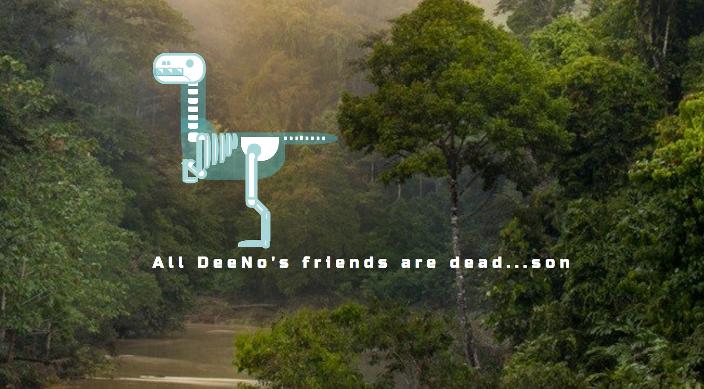

# _Dino Ipsum_

#### By _**Ellie Angell**_

<!--  -->

## Description:
A web app that follows along the lines of hangman, where users get to guess letters to figure out what dinosaur it is.

## Setup/Installation Requirements

1. Download this repo using your terminal: git clone https://github.com/ellie-a/dino-ipsum

2. Use npm install and bower install in the top level of the project directory in the terminal  to retrieve packages used ex:
    $npm install, $bower install

3. View the code by drag-and-dropping the file into your [favorite text editor](https://atom.io).
    If you don't have the atom package for typescript I highly suggest it. Install globally by using the command : apm install atom-typescript

4. Run by doing a gulp build, then gulp serve

## Known Bugs

_There are no known bugs_

## Support and contact details

For questions or comments, please __email  [Ellie here.](elliea915@gmail.com)__

## Technologies Used

* HTML5
* Gulp
* Bower
* CSS3 with Sass
* JavaScript with jQuery 3.1

### License

Copyright (c) 2017 **_Ellie Angell_**

This program is free software: you can redistribute it and/or modify
    it under the terms of the GNU General Public License as published by
    the Free Software Foundation, either version 3 of the License, or
    (at your option) any later version.

    This program is distributed in the hope that it will be useful,
    but WITHOUT ANY WARRANTY; without even the implied warranty of
    MERCHANTABILITY or FITNESS FOR A PARTICULAR PURPOSE.  See the
    GNU General Public License for more details.

    You should have received a copy of the GNU General Public License
    along with this program.  If not, see <http://www.gnu.org/licenses/>.
